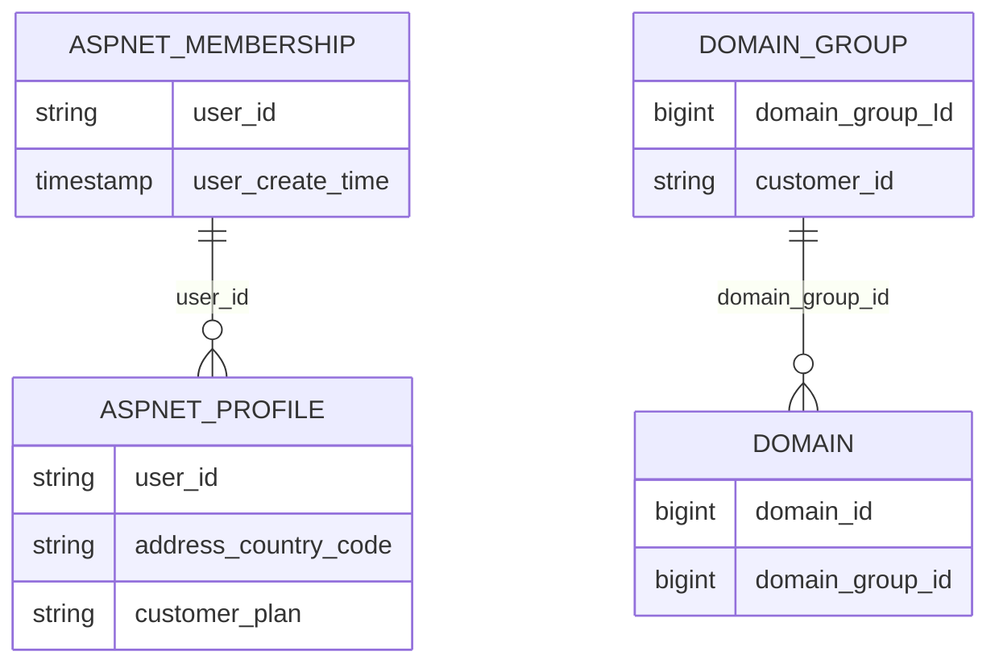

# Entity-Relationship Diagram (ERD)

## Relationships
- **Users:** `aspnet_membership` and `aspnet_profile` are linked by `user_id`.
- **Domains:** `domain_group` and `domain` are linked by `domain_group_id`.
- **Note:** All tables appear to be SCD Type 2 or historical logs, as primary keys are not unique across the entire table.
